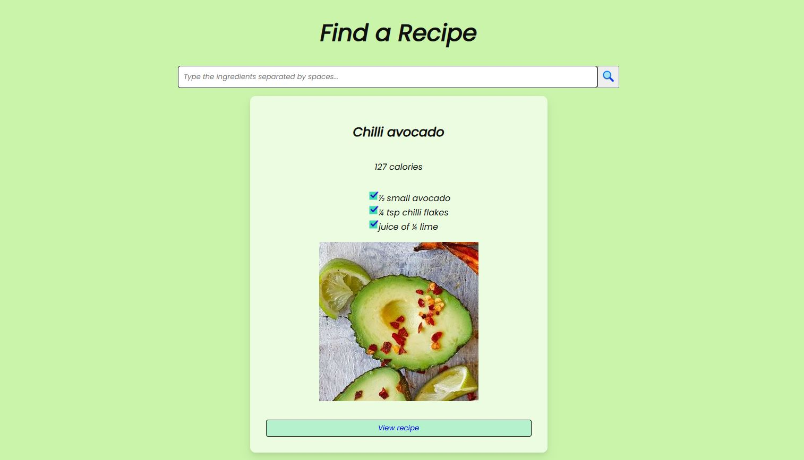

# Recipe Search by Ingredients

## Demo  
🔗 View the app on Netlify (https://lily-find-recipe.netlify.app)

## Project Description

**Recipe Search by Ingredients** is a small educational React application that allows users to search for recipes using one or multiple ingredients.

The app is built with **React (Vite)** and consists of two main components:
- One component contains the application logic, title, and search input.
- The second component displays the list of recipes retrieved from the API.

The application uses the `useEffect` hook to fetch data from an external API.  
Three `useState` hooks are implemented:
- One state stores the value entered in the input field.
- The second state stores the array of recipes received from the API.
- The third state stores the ingredient(s) used to perform the search.

No installation is required.

## Here's what the app looks like:

## How to Use:
- Enter one or more ingredients into the search input.
- Press **Enter** or click the **search icon**.
- The app will display recipes that include the specified ingredient(s).

## Features:
- Search for recipes by one or multiple ingredients.
- Fetching recipe data from an external API using `useEffect`.
- State management using React `useState`.
- Component-based architecture.
- Simple and intuitive user interface.

## Requirements:
- A modern web browser.
- JavaScript enabled.

